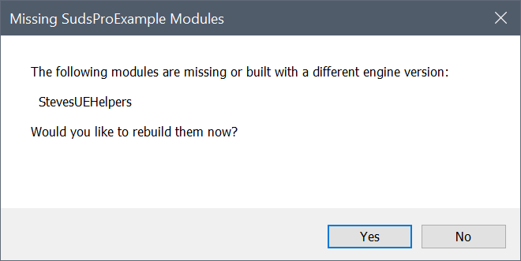

# SUDS Pro Example Project

This is the example project for [SUDS Pro](https://www.unrealengine.com/marketplace/en-US/product/98046b91d2d4470f8c10db3589b3640e).

## Using a Pre-built version

This example uses another one of my open source projects, [Steves UE Helpers](https://github.com/sinbad/StevesUEHelpers).
So even though this example project is Blueprint-only, it does need to build this
plugin. If you want to skip this step, download a pre-built example
 (Windows only).

 [Download Prebuilt Example](https://github.com/sinbad/SUDSProExample/releases)

## Building From Source

If you use the source release, when you open SudsProExample.uproject, you'll be prompted
as follows:

Click Yes to build (you will need a Visual Studio C++ compiler installed).

## Documentation

To understand what's going on in this example project, please refer to the
[SUDS Pro Documentation](https://olddoorways.com/sudspro/docs/).
