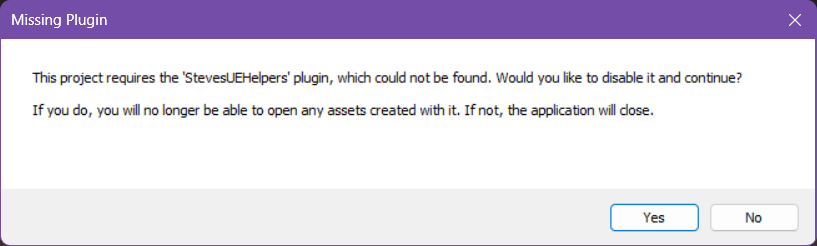

# SUDS Pro Example Project

This is the example project for [SUDS Pro](https://www.unrealengine.com/marketplace/en-US/product/98046b91d2d4470f8c10db3589b3640e).

## Steve's UE Helpers Plugin

This example uses another one of my open source projects, "Steves UE Helpers", to provide convenient 
features such as better gamepad support and a typewriter text widget. 

You need to [install this plugin from Fab](https://www.fab.com/listings/6a48c58c-1771-42f6-b46f-2b09e31b1699) to run the example, otherwise you will see this error on opening the project:

Click "No" if you see that and [get the plugin from Fab](https://www.fab.com/listings/6a48c58c-1771-42f6-b46f-2b09e31b1699).

> You don't have to use my helpers plugin in your own projects if you don't want to. 
> But the demo is made so much better with typewriter text and good gamepad support (I find CommonUI too unreliable in this regard)

You can also check out the [source code for the helpers plugin](https://github.com/sinbad/StevesUEHelpers) if you like.

## Documentation

To understand what's going on in this example project, please refer to the
[SUDS Pro Documentation](https://olddoorways.com/sudspro/docs/).
